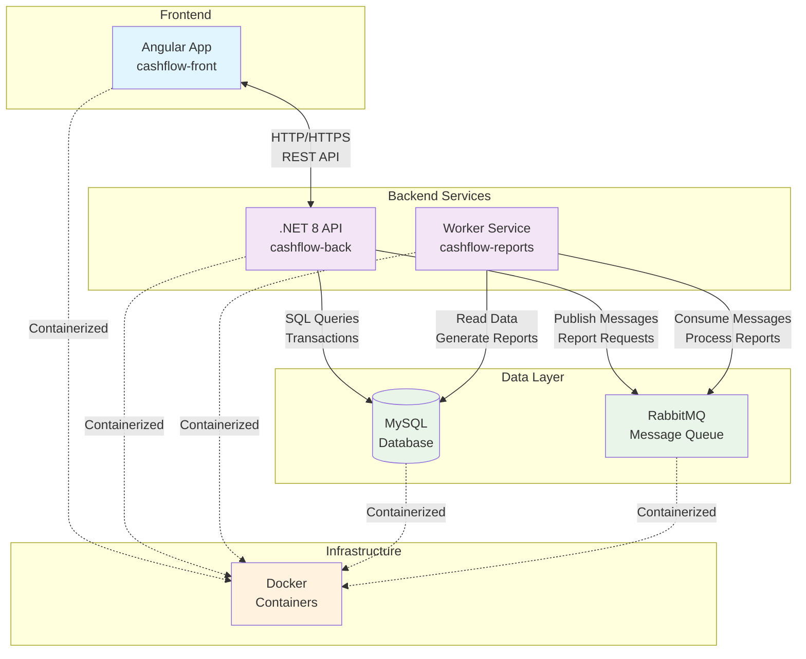

# Arquitetura do Sistema CashFlow

## Visão Geral

O sistema CashFlow é uma aplicação distribuída para gerenciamento de fluxo de caixa, composta por múltiplos serviços que trabalham em conjunto para fornecer uma solução completa de gestão financeira.

## Componentes da Arquitetura

### 1. Frontend (Angular)
- **Localização**: `cashflow-front/`
- **Tecnologia**: Angular com TypeScript
- **Responsabilidades**:
  - Interface de usuário para gestão de fluxo de caixa
  - Comunicação com a API backend
  - Apresentação de dados e relatórios

### 2. Backend API (.NET 8)
- **Localização**: `cashflow-back/`
- **Tecnologia**: .NET 8 Web API
- **Responsabilidades**:
  - Processamento de regras de negócio
  - Gerenciamento de dados financeiros
  - Autenticação e autorização
  - Publicação de mensagens para geração de relatórios

### 3. Worker de Relatórios (.NET 8)
- **Localização**: `cashflow-reports/`
- **Tecnologia**: .NET 8 Worker Service
- **Responsabilidades**:
  - Processamento assíncrono de relatórios
  - Consumo de mensagens do RabbitMQ
  - Geração de relatórios financeiros

### 4. Banco de Dados
- **Tecnologia**: MySQL
- **Responsabilidades**:
  - Armazenamento persistente de dados financeiros
  - Transações e consultas de dados

### 5. Mensageria
- **Tecnologia**: RabbitMQ
- **Responsabilidades**:
  - Comunicação assíncrona entre serviços
  - Enfileiramento de solicitações de relatórios
  - Garantia de entrega de mensagens

## Diagrama da Arquitetura



## Fluxo de Dados

### 1. Operações CRUD (Frontend ↔ API ↔ Database)
```
Frontend ←→ API ←→ MySQL
    ↑       ↑       ↑
    │       │       │
    │       │       └── Retorna dados
    │       └────────── Processa e retorna
    └────────────────── Recebe resposta
```

### 2. Geração de Relatórios (Assíncrona)
```
Frontend → API → RabbitMQ → Worker → MySQL
                              ↓
                           Reports
```

## Padrões Arquiteturais Implementados

### 1. **Microserviços**
- Separação clara de responsabilidades
- Serviços independentes e especializados
- Comunicação via HTTP e mensageria

### 2. **Event-Driven Architecture**
- Comunicação assíncrona via RabbitMQ
- Desacoplamento entre serviços
- Processamento em background

### 3. **Clean Architecture**
- Estrutura em camadas bem definidas
- Separação de concerns
- Testabilidade e manutenibilidade

### 4. **Domain-Driven Design (DDD)**
- Modelagem rica do domínio financeiro
- Separação clara entre camadas (Domain, Application, Infrastructure)
- Entities, Value Objects e Domain Services bem definidos
- Repositórios para abstração de acesso a dados

## Tecnologias Utilizadas

| Componente | Tecnologia | Versão |
|------------|------------|---------|
| Frontend | Angular | Latest |
| Backend API | .NET | 8.0 |
| Worker | .NET | 8.0 |
| Database | MySQL | Latest |
| Message Broker | RabbitMQ | Latest |
| Containerization | Docker | Latest |
| Orchestration | Docker Compose | Latest |

## Vantagens da Arquitetura

### ✅ **Escalabilidade**
- Cada serviço pode ser escalado independentemente
- Processamento assíncrono de relatórios

### ✅ **Resiliência**
- Falhas em um serviço não afetam os outros
- Sistema de filas garante processamento de mensagens

### ✅ **Manutenibilidade**
- Código organizado em camadas
- Separação clara de responsabilidades

### ✅ **Performance**
- Operações assíncronas para tarefas pesadas
- Cache e otimizações por serviço

### ✅ **Flexibilidade**
- Fácil adição de novos serviços
- Tecnologias podem evoluir independentemente

## Considerações de Deploy

### Docker Compose
O sistema utiliza Docker Compose para orquestração dos serviços, facilitando:
- Deploy local para desenvolvimento
- Configuração de rede entre containers
- Gerenciamento de variáveis de ambiente
- Persistência de dados

### Ambientes
- **Development**: Configuração local com hot-reload
- **Testing**: Ambiente para testes automatizados
- **Production**: Configuração otimizada para produção

## Monitoramento e Observabilidade

### Logs
- Logs estruturados em cada serviço
- Agregação centralizada de logs

### Health Checks
- Endpoints de saúde em cada serviço
- Monitoramento de dependências

