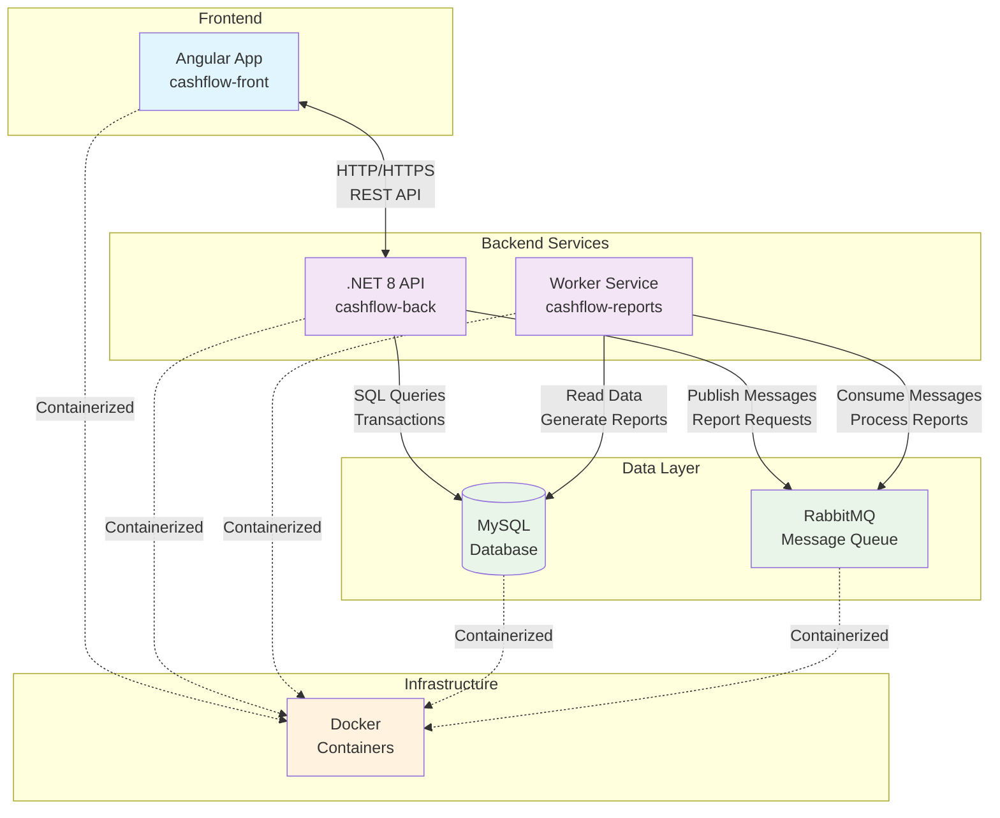

# 💰 CashFlow - Sistema de Gestão Financeira


Um sistema completo de gestão financeira desenvolvido com arquitetura de microsserviços, utilizando .NET, Angular e mensageria assíncrona.

## 🏗️ Arquitetura do Sistema



### 📂 Componentes

- **[Frontend](./cashflow-front)**: Interface web em Angular com dashboard interativo
- **[Backend](./cashflow-back)**: API REST em .NET 8 com autenticação JWT
- **[Reports Worker](./cashflow-reports)**: Processamento assíncrono de relatórios
- **MySQL**: Banco de dados relacional
- **RabbitMQ**: Mensageria para comunicação assíncrona

## 🚀 Como Executar

### Execução Rápida

```bash
# Clone o repositório com todos os submódulos
git clone --recursive https://github.com/Dougllas-code/cashflow-system

# Entre no diretório
cd cashflow-system

# Configure as variáveis de ambiente
cp .env.example .env

# Execute todos os serviços
docker-compose up
```

### Acessos

- **Frontend**: http://localhost
- **API Backend**: http://localhost:5000
- **RabbitMQ Management**: http://localhost:15672 (admin/admin123)
- **MySQL**: localhost:3306

## 🛠️ Tecnologias Utilizadas

### Frontend
- **Angular 18** - Framework web moderno
- **TypeScript** - Linguagem com tipagem estática
- **SCSS** - Estilização avançada
- **Nginx** - Servidor web para produção

### Backend
- **.NET 8** - Framework principal
- **Entity Framework Core** - ORM para acesso a dados
- **JWT Authentication** - Autenticação segura
- **AutoMapper** - Mapeamento de objetos
- **FluentValidation** - Validação de dados

### Infrastructure
- **MySQL 8.0** - Banco de dados relacional
- **RabbitMQ** - Message broker para comunicação assíncrona
- **Docker & Docker Compose** - Containerização e orquestração

## 📁 Estrutura do Projeto

```
cashflow-system/
├── 🌐 cashflow-front/          # Frontend Angular
├── ⚡ cashflow-back/           # API Backend .NET
├── 📊 cashflow-reports/        # Worker de Relatórios
├── 🐳 docker-compose.yml       # Orquestração completa
├── ⚙️ .env.example            # Configurações de ambiente
└── 📖 README.md               # Esta documentação
```

## 🔧 Desenvolvimento Local

### Pré-requisitos
- Docker e Docker Compose
- Git
- Node.js (para desenvolvimento frontend)
- .NET 8 SDK (para desenvolvimento backend)

### Comandos Úteis

```bash
# Inicializar submódulos (se não usou --recursive)
git submodule update --init --recursive

# Atualizar todos os submódulos para a versão mais recente
git submodule update --remote

# Trabalhar em um submódulo específico
cd cashflow-front
git checkout main
# Faça suas alterações...
git add . && git commit -m "feat: nova funcionalidade"
git push origin main

# Volte ao repositório principal e atualize a referência
cd ..
git add cashflow-front
git commit -m "chore: atualiza referência do frontend"
```

### Desenvolvimento Individual dos Serviços

#### Frontend (Angular)
```bash
cd cashflow-front
npm install
ng serve
# Disponível em http://localhost:4200
```

#### Backend (.NET)
```bash
cd cashflow-back
dotnet restore
dotnet run --project src/CashFlow.Api
# Disponível em http://localhost:5000
```

#### Worker Reports
```bash
cd cashflow-reports
dotnet restore
dotnet run --project Cashflow-reports
```

## 🐳 Comandos Docker

```bash
# Iniciar todos os serviços
docker-compose up -d

# Ver logs de todos os serviços
docker-compose logs -f

# Ver logs de um serviço específico
docker-compose logs -f backend

# Parar todos os serviços
docker-compose down

# Rebuild e restart
docker-compose up -d --build

# Limpar volumes (⚠️ apaga dados do banco)
docker-compose down -v
```

## ⚙️ Configuração de Ambiente

### Variáveis de Ambiente

Copie o arquivo `.env.example` para `.env` e ajuste as configurações:

```bash
# Database Configuration
MYSQL_ROOT_PASSWORD=sua_senha_mysql
MYSQL_DATABASE=cashflowdb

# RabbitMQ Configuration
RABBITMQ_DEFAULT_USER=admin
RABBITMQ_DEFAULT_PASS=admin123

# JWT Configuration (use uma chave com pelo menos 32 caracteres)
JWT_SIGNING_KEY=sua_chave_jwt_super_secreta_com_pelo_menos_32_caracteres

# Application Environment
ASPNETCORE_ENVIRONMENT=Production
```

### Configurações por Ambiente

| Ambiente | Database Host | RabbitMQ Host | Uso |
|----------|---------------|---------------|-----|
| Development | `localhost` | `localhost` | Desenvolvimento local |
| Production | `mysql` | `rabbitmq` | Docker Compose |

## 🏃‍♂️ Health Checks

O sistema possui health checks configurados:
- **Backend API**: `GET /Health`
- **MySQL**: Ping interno do mysqladmin
- **RabbitMQ**: Diagnostics ping

## 📊 Funcionalidades

### 💰 Gestão Financeira
- ✅ Cadastro de receitas e despesas
- ✅ Categorização de transações
- ✅ Dashboard com visão geral
- ✅ Filtros por período e categoria

### 📈 Relatórios
- ✅ Relatórios em PDF
- ✅ Relatórios em Excel para análise
- ✅ Processamento assíncrono via RabbitMQ
- ✅ Histórico de relatórios gerados

### 🔐 Segurança
- ✅ Autenticação JWT
- ✅ Autorização baseada em roles
- ✅ Validação de dados robusta
- ✅ Tratamento de erros centralizado

## 🧪 Testes

```bash
# Backend
cd cashflow-back
dotnet test

# Frontend
cd cashflow-front
npm test

# Worker
cd cashflow-reports
dotnet test
```

## 📄 API Documentation

Quando o backend estiver rodando, acesse:
- **Swagger UI**: http://localhost:5000/swagger

## 🤝 Contribuindo

1. Fork o projeto
2. Crie uma branch (`git checkout -b feature/AmazingFeature`)
3. Commit suas mudanças (`git commit -m 'Add some AmazingFeature'`)
4. Push para a branch (`git push origin feature/AmazingFeature`)
5. Abra um Pull Request

## 📋 Roadmap

- [ ] Implementar notificações em tempo real
- [ ] Dashboard avançado com métricas
- [ ] API para integração com bancos
- [ ] App mobile React Native
- [ ] Análise de dados com IA

## 👨‍💻 Autor

**Dougllas Souza** - [@Dougllas-code](https://github.com/Dougllas-code)

## 🔗 Repositórios dos Serviços

- 🌐 [CashFlow Frontend](https://github.com/Dougllas-code/cashflow-front)
- ⚡ [CashFlow Backend](https://github.com/Dougllas-code/cashflow-back)  
- 📊 [CashFlow Reports](https://github.com/Dougllas-code/cashflow-reports)

## 📝 Licença

Este projeto está sob a licença MIT. Veja o arquivo [LICENSE](LICENSE) para mais detalhes.

---

⭐ **Se este projeto te ajudou, por favor considere dar uma estrela!**